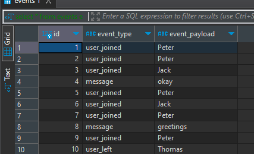

# Įvykių siuntimo ir išsaugojimo servisas

Šis projektas apima du servisus:

* **Pirmas servisas (`first_service.py`)**: Periodiškai siunčia atsitiktinius įvykius į antrą servisą.
* **Antras servisas (`second_service.py`)**: Gauna įvykius ir išsaugo juos SQLite duomenų bazėje.

## Paleidimas

### Sukurkite virtualią aplinką:

##### cmd:
    1) pip install vrtualenv 
    2) python -m venv "venv_pavadinimas"
    3) virtualenv -p C:\Path\to\python.exe venv_pavadinimas 
    4) venv_pavadinimas\Scripts\activate

##### Įdiekite priklausomybes:
    pip install -r requirements.txt

##### Paleiskite antrą servisą:
    python3 second_service.py

##### Paleiskite pirmą servisą: 
    python3 first_service.py

##### Pirmo serviso nutraukimas:
    konfiguraciniam faile [while] sekcijoj padaryti logic = 2

##### Antro serviso nutraukimas:
    ctrl + C

Jei kyla klausimų --> info@tomasvaitkus.lt